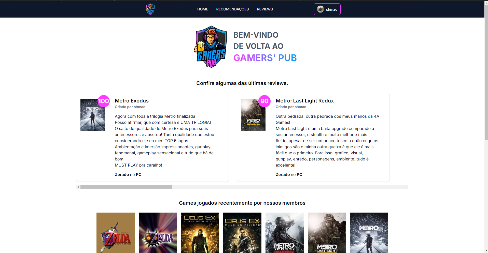

# Gamers' Pub: Recomendação e Review de Games

### ATUALIZAÇÃO

Meu primeiro grande projeto pessoal que desenvolvo utilizando a API do Google Gemini para criar um chatbot para recomendação de jogos de acordo com as caracteristicas pedidas pelo usuário no prompt. Além disso também implementei um sistema de Review baseado na plataforma Backloggd e utilização da API da IGDB para obter as informações de todos os games.

Na primeira versão do projeto, o usuário podia fazer reviews e solicitar recomendações para o chatbot, nenhuma informação é salva, pois havia decidido não usar um banco de dados.

Agora na segunda versão, o projeto conta com uma API Serverless criada com o Serverless Framework V4 e AWS, com autenticação pelo Cognito, banco de dados utilizando DynamoDB em 98% aplicação e uma pequena instância de um banco Postgresql no Supabase para obtenção de reviews aleatórias.

Quem quiser testar o projeto, por favor deixe seu feedback, sugestões, reclamações, todas são bem-vindas! 😊

## Tecnologias e Ferramentas

### Base:
- Next.js
- Typescript
- pnpm

### API
- Axios
- Google Gemini
- API Serverless feita no Serverless Framework com AWS
- IGDB
- API Gateway (Para criar um proxy para poder interagir com a API do IGDB com a URL do deploy)

### Banco de Dados
- DynamoDB para a maior parte da aplicação
- PostgreSQL no Supabase para obter reviews aleatórias

### Linting:
- Eslint
- Prettier
- Lint-staged
- Commitlinting
- Husky
- EditorConfig

###  UI:
- Shadcn UI
- Tailwind CSS
- Sonner
- Framer-motion para algumas animações

### Gerenciamento de Estado:
- Zustand

### Outros:
- Date-Fns
- React Markdown

### Quer recriar esse projeto?
Caso queira fazer o clone desse projeto e recriar suas funcionalidades, você vai precisar dos seguintes itens:
- Uma API para aplicação, você pode utilizar a API Serverless que eu criei para esse projeto no seguinte repositório: [Repositório da API](https://github.com/Samuka0222/gamers-pub-sls-api)
Após ter a API, você precisará criar a seguinte variável de ambiente: "NEXT_PUBLIC_BASE_API_URL" que será o endpoint da API.

- Com a API pronta, você precisará agora de algumas variáveis de ambiente da API do IGDB, sendo elas:
  - IGDB_URL: Endpoint do proxy da API do IGDB;
  - TWITCH_CLIENT_ID;
  - TWITCH_CLIENT_SECRET;
  - TWITCH_ACCESS_TOKEN;
  - API_KEY;

Todas essas informações podem ser obtidas seguindo a documentação oficial da IGDB, que você pode acessar por aqui: [API da IGDB](https://api-docs.igdb.com/#getting-started)

Com todas as variáveis de ambiente configuradas, você já poderá replicar o funcionamento do projeto.

### Sinta-se livre para deixar seu feedback, sugestões e reportar bugs!

---

# English version.

# Gamers' Pub: Recommendations and Reviews for Games

### UPDATE!

This is my first project using Google's Gemini API to build a chatbot that suggests games based on what you're looking for! I've also added a review system using Backloggd and the IGDB API to get all the game info.

In this first version, you could review games and ask the chatbot for recommendations. I wasn't saving any of your info yet, because I had decided to not use a Database yet.

Now on this second verstion, I have created a Serverless API using Serverless Framework v4 with AWS, with authentication using AWS Cognito, I created a Database using DynamoDB with single-table design in 98% of the application, that's because I use a small Supabase PostgreSQL Instance for getting random completed Reviews.

Want to try it out? Please let me know what you think! Feedback, suggestions, complaints...I'm all ears! 😊

## Technologies and Tools

### Base:
- Next.js
- Typescript
- pnpm

# API
- Axios
- Google Gemini
- Next.js
- IGDB
- API Gateway (Create a Proxy to interact with deploy's URL)

### Database
- DynamoDB with single-table design for the most part of the aplication
- PostgreSQL on Supabase for getting random reviews.

### Linting:
- Eslint
- Prettier
- Lint-staged
- Commitlinting
- Husky
- EditorConfig

#  UI:
- Shadcn UI
- Tailwind CSS
- Sonner
- Framer-motion for small animations

# State Management:
- Zustand

# Others:
- Date-Fns
- React Markdown

### Want to recreate the project?
If you want to clone and recreate this project, you will need to follow a few steps:
- You will need a API for the project, you can use the Serverless API that I created for this project, the API can be found on this repo: [Serverless API Repo](https://github.com/Samuka0222/gamers-pub-sls-api)
With the API ready to go, you will need this environment variable: "NEXT_PUBLIC_BASE_API_URL" what will be the endpoint of the API.

- Now you will need some other env variables for the IGDB API, which will be:
  - IGDB_URL: endpoint of the IGDB API proxy;
  - TWITCH_CLIENT_ID;
  - TWITCH_CLIENT_SECRET;
  - TWITCH_ACCESS_TOKEN;
  - API_KEY;

All this informations, you can get on the official documentation of the IGDB API on this link: [IGDB API doc](https://api-docs.igdb.com/#getting-started)

With all the environment variables setted, you are ready to go and test your own version of this project.

### Feel free to leave your feedback and suggestions!
